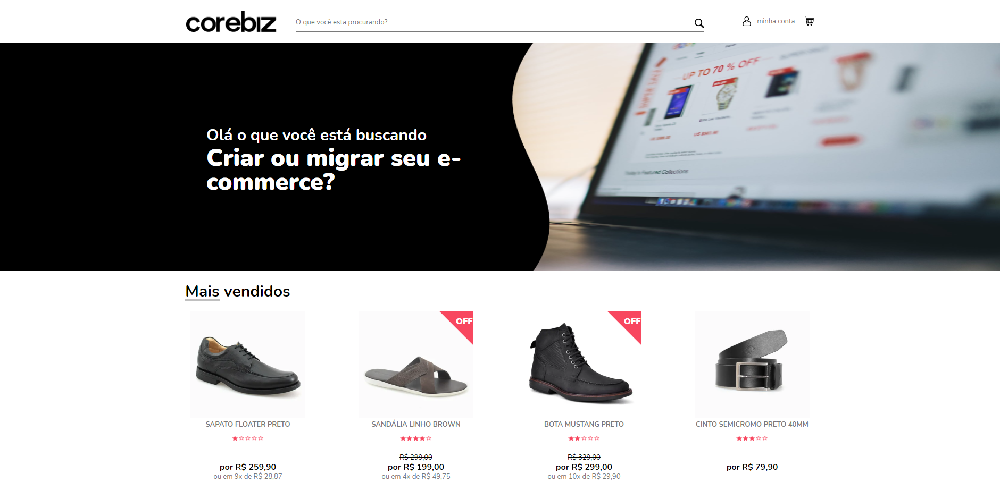

<h1 align="center">
Teste Front-End Corebiz
</h1>

<p align="center"> Esse repositorio é um teste feito para a vaga de desenvolvedor Front-end junior na Corebiz </p>

<p align="center">
  
  
  <br/>
</p>

<hr>

<p align="center">
  
<p>

## Dificuldades
Em relação a o projeto desenvolvida minha maior dificuldade foi a conexão com a API onde eu consegui pegar os dados apos ter acompanhado a aula do professor Bonieky Lacerda, após ter pego os dados da API foi a hora de expor eles em tela de modo geral não tive dificuldades nessa parte, mesmo quando tinha que fazer um "if" para saber se determinado dado existe ou não na API ainda em relação a exibir os dados tive um pouco de complicações em expor as "stars" onde foi necessario fazer um "for" para pegar o valor da nota do produto.

## Aprendizado
Como citado a cima a conexão de API foi necessario aprender na durante o teste mas acompanhando a video aula foi possivél receber os dados sem problemas, mas um dos principais aprendizado sem duvida foi em relação a organização dos codigo onde tentei ao maximo economizar codigos e fazer um codigo de facil entendimento apesar do tempo ter ficado curto... (Aguardem que será feito as funções q não consegui fazer no prazo e postarei aqui)

## Tecnologias Utilizadas

- [X] React
- [X] Javascript
- [X] Css

## :arrow_forward: Como executar

_com **npm**_

```bash
# Instalar dependências
$ npm install
# Iniciar servidor
$ npm start
```

_com **yarn**_

```bash
# Instalar dependências
$ yarn
# Iniciar servidor de desenvolvimento
$ yarn start
```

---

---

